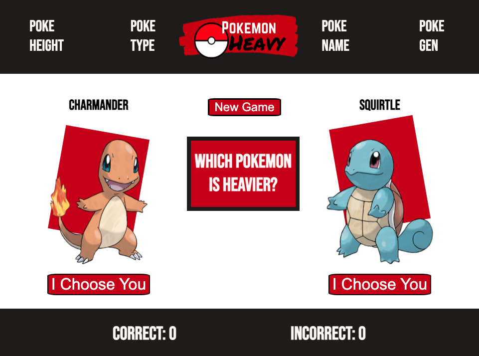
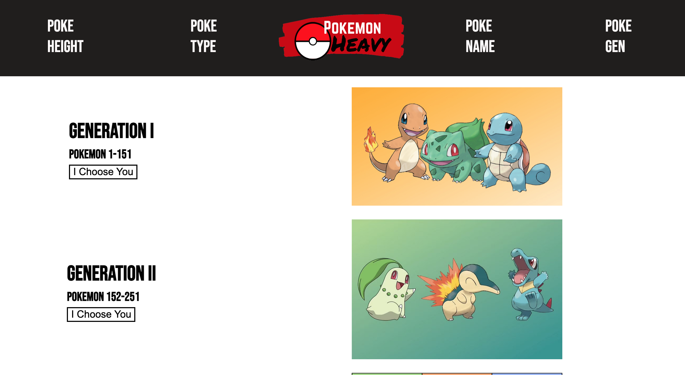

# Pokemon Heavy

In this project a Pokemon API is used to provide data for 3 trivia games that test the user's knowledge of pokemon weight, height, and type. There is a function that allows the user to select which generation of Pokemon they want to be quizzed on. There is a pokemon name page that allows the user to learn the height, type, and weight of any Pokemon. 

# Technologies Used
- HTML
- CSS
- JavaScript/jQuery
- Google Fonts
- PokeAPI

# Screenshots

# Getting Started
[Click here](https://pokemon-heavy.vercel.app/) to see the deployed project. Note: there are 5 pages for this project. This link goes to the main page.

# Future Enhancements
A counter that keeps track of high scores.